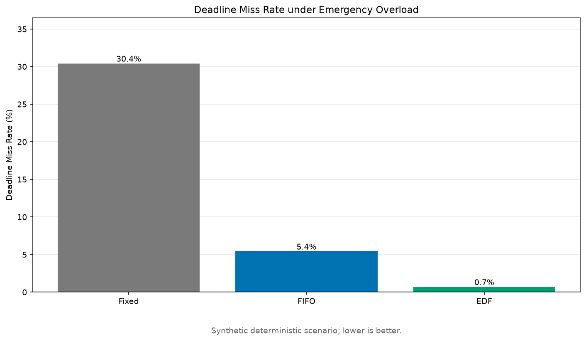

# Autodrive Heterogeneous Scheduler

[](https://github.com/qinqin423/autodrive-heterogeneous-scheduler/actions/workflows/tests.yml)

A reproducible discrete-event simulation project for scheduling autonomous-driving AI services on heterogeneous CPU, GPU, and NPU resources.

The project is being developed as an engineering portfolio and research prototype. Version `v0.1` provides the minimum simulation loop, two baseline schedulers, configuration validation, CSV/JSON outputs, and automated tests.

## Motivation

Autonomous-driving systems execute perception services with different priorities, deadlines, and hardware affinities. Static resource binding may waste heterogeneous compute capacity or cause urgent tasks to miss their deadlines. This project models those constraints and evaluates scheduling strategies under controlled workloads.

## Current scope

- Configurable AI services and heterogeneous devices
- Periodic workload generation with deterministic random seeds
- Static fixed-mapping baseline
- FIFO task ordering with earliest-finish resource selection
- Non-preemptive EDF scheduler (Earliest Deadline First) within each device's wait queue
- DRAS (Deadline- and Resource-Aware Scheduler) v0.3 first version: inherits EDF queue ordering and adds a load- and deadline-aware resource selection score
- Deadline miss rate, response latency, throughput, and utilization metrics
- Reproducible CSV and JSON result files
- Unit tests for configuration, scheduling, and simulation

This is a simulator, not a production in-vehicle deployment. Device latency values in the initial configuration are synthetic and will later be supplemented with measured model profiles.

## Quick start

```bash
python -m venv .venv
source .venv/bin/activate
python -m pip install -e '.[dev]'

autodrive-sim \
  --scheduler fifo \
  --scenario configs/scenarios/smoke.yaml \
  --output results/fifo-smoke

pytest -q
```

Run Fixed/FIFO/EDF baselines:

```bash
python scripts/run_baselines.py
```

Run high-load scenario:

```bash
python scripts/run_baselines.py --scenario configs/scenarios/high_load.yaml
```

Run emergency overload scenario:

```bash
python scripts/run_baselines.py --scenario configs/scenarios/emergency_overload.yaml
```

## Repository layout

```text
configs/       Device, service, and driving-scenario configuration
src/           Models, schedulers, simulation engine, and metrics
scripts/       Reproducible experiment entry points
tests/         Unit and integration tests
results/       Small sample outputs; large generated results are ignored
docs/          Design notes and experiment protocol
```

## Roadmap

- `v0.1`: Fixed/FIFO baselines and minimum reproducible simulation
- `v0.2`: EDF scheduler, dependency-aware service chains, more scenarios
- `v0.3`: Deadline- and Resource-Aware Scheduler (DRAS) and ablations
- `v0.4`: CPU/GPU model profiling and trace-driven experiments
- `v1.0`: Complete paper experiments, documentation, and portfolio release

**v0.2 progress**: EDF baseline, deterministic high-load/emergency scenarios, and benchmark reporting implemented.

**v0.3 progress**: DRAS first version implemented (inherits EDF queue ordering, adds a deadline- and load-aware resource selection score). Performance validation against EDF is planned via ablation experiments. See [DRAS design](docs/dras_design.md).

**Reproducibility**: Simulation time, task streams, and deadline metrics are deterministic under fixed configurations and random seeds. Scheduler overhead is measured from actual wall-clock time and may vary across machines and runs.

## Benchmark snapshot



This synthetic deterministic benchmark compares Fixed, FIFO, and EDF scheduling policies under high-load and emergency overload scenarios. See [full benchmark results](docs/benchmark_results.md) for detailed metrics.

Generate the report:

```bash
python -m pip install -e ".[benchmark]"
python scripts/generate_benchmark_report.py
```

## Research integrity and public release

The public version should contain only generic code, synthetic or openly sourced configurations, and reproducible results. Do not commit internal datasets, unpublished manuscripts, confidential device parameters, private logs, or third-party model weights.

